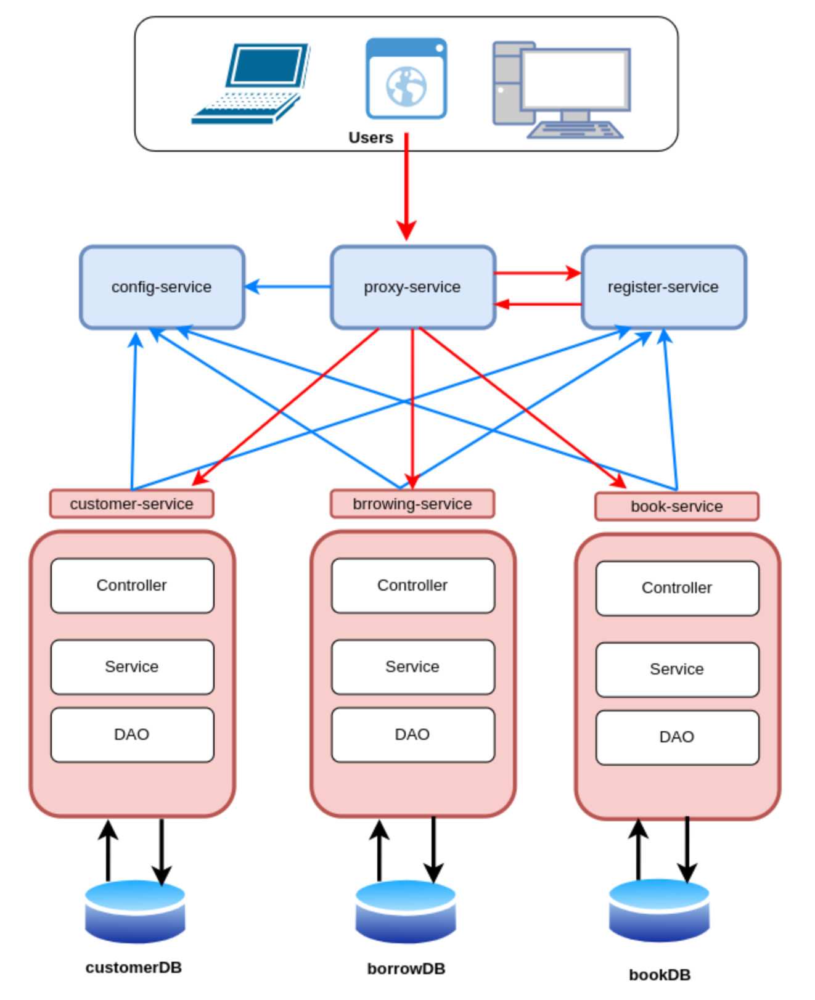
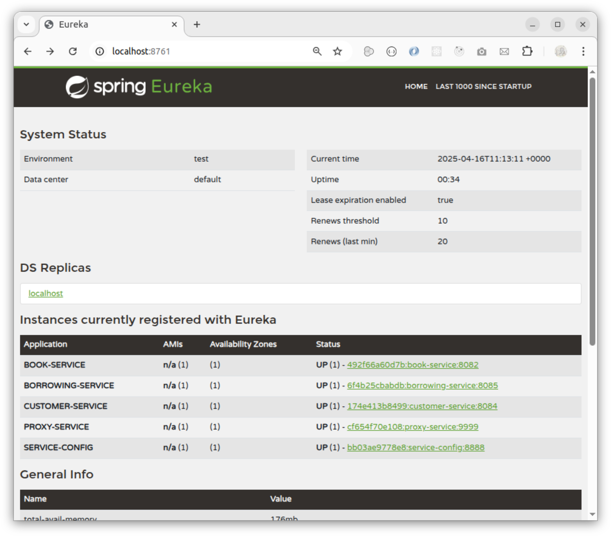
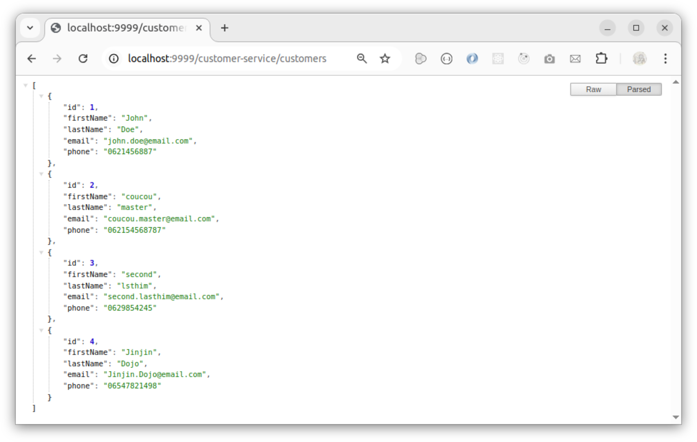
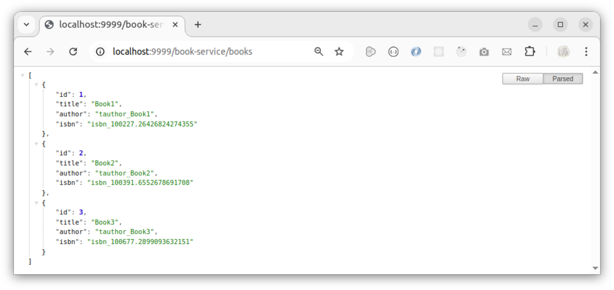
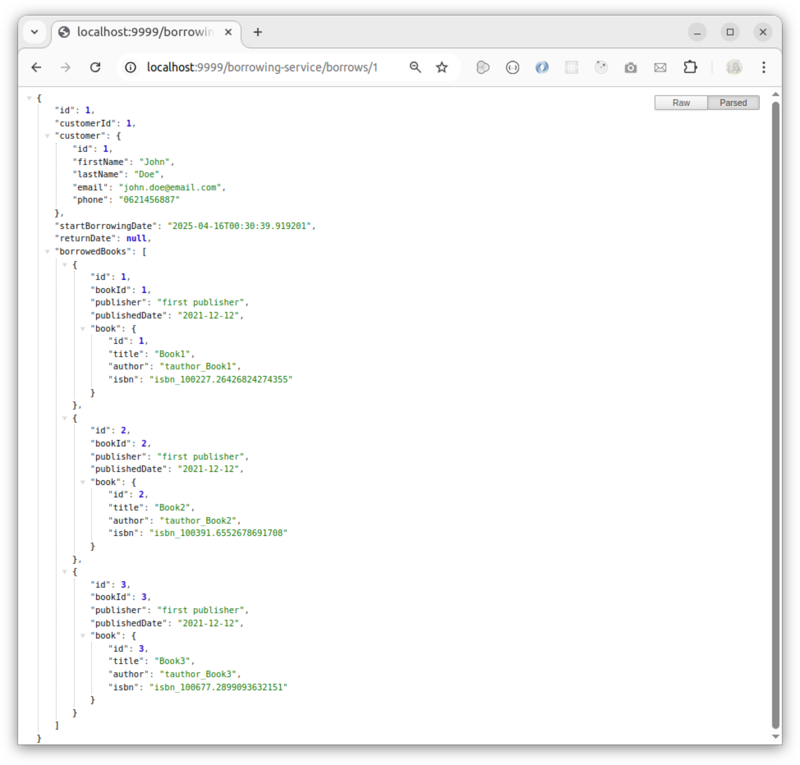

# microservices-springboot-springcloud

In this project we explain how to dockerize the developed microservices based on Spring Boot that we can find ion this github link : _https://github.com/a-farsi/microservices-springboot-springcloud_

In the previous project we developed three functional microservice: 
- A first one for customer management.
- A second for book management. 
- A third for book borrowing management.

In addition, we developed three technical microservices:

- A microservice for the automatic registration of microservice instances.
- A microservice for centralized configuration management of the microservices.
- A microservice acting as a gateway or proxy.

The following figure illustrates the overall architecture of our microservice application.

<p align="center">

</p>
<p align="center">
Figure 1: Architecture of our application based-on microservices 
</p>

### How to Dockerize our Spring Boot based Microservices


To dockerize our microservices we need to build each SpringBoot project to generate _.jar_ file. this step can be done by running the following command: 

```#gradle
./gradelw clean build -x test
``` 

Then we create a Dockerfile in each project in order to build an the corresponding images.

The Dockerfile is ...(simple description)
See if it's important to see create volume ? and mount point


### Microservices Startup Order
We must follow a specific startup order for the microservices to ensure they are properly configured at launch and correctly registered with the discovery service.
Therefore, we start with the discovery-service, followed by the config-service.
The startup order of the following application microservices is not critical: customer-service, book-service, and borrowing-service.
Finally, we launch the gateway-service.

#### Automate creating images and launching microservices
..explain the docker-compose
..the healthy

#### Haw to call microservices through the gateway

* The discovery-service 

If All microservice are started up properly, we can see that they are registered on the register-service as shown in the following figures.
try 

<p align="center">

</p>
<p align="center">
Figure 2: The discovery service that displays all registered services 
</p>

* The customer-service

To call the customer-service through the gateway, we need to reach the gateway on each url localhost:9999 then we specify the customer-service name then we specify the endpoint on the customer-service.

<p align="center">

</p>
<p align="center">
Figure 3: Calling the customer-service through the gateway-service 
</p>

* The book-service

<p align="center">

</p>
<p align="center">
Figure 4: Calling the books-service through the gateway-service 
</p>

* The borrowing-service
To get a borrow object that is identified by its _id = 1_ and which associate a customer that borrows a list of borrowedbook objects, we type on the url : _http://localhost:9999/borrowing-service/borrows/1_ 

<p align="center">

</p>
<p align="center">
Figure 5: Calling the borrow object identifies by id=1 through the gateway-service 
</p>


