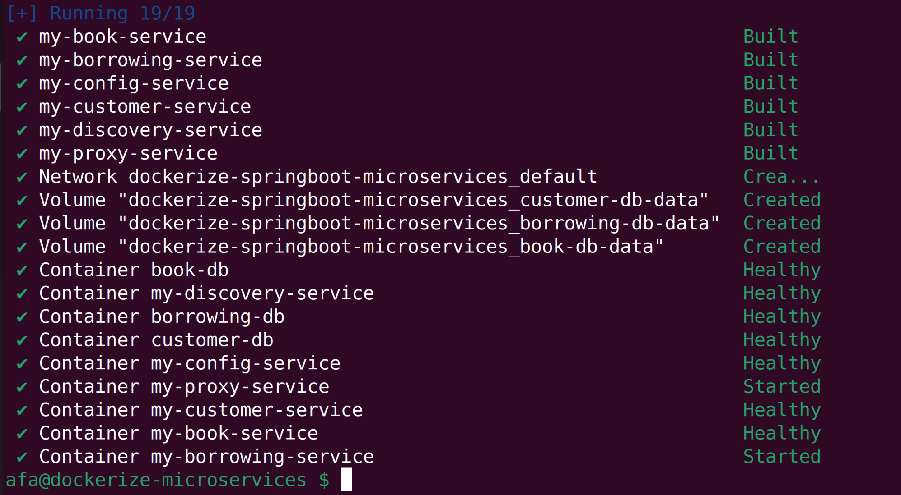
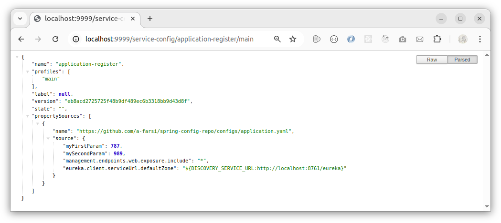

# microservices-springboot-springcloud

In this project, we explain how to dockerize the developed microservices based on Spring Boot that we can find in this github link : _https://github.com/a-farsi/microservices-springboot-springcloud_

In the previous project, we developed three functional microservices: 
- A first one for customer management.
- A second for book management. 
- A third for book borrowing management.

In addition, we developed three technical microservices:

- A microservice for the automatic registration of microservice instances.
- A microservice for centralized configuration management of the microservices.
- A microservice acting as a gateway or proxy.

It's worth mentioning that each functional microservice saves its data in a separate database. Our choice is to work with PostgreSQL. So, we will dockerize also three PostgreSQL databases: customerdb, bookdb and borrowingdb. 

The following figure illustrates the overall architecture of our microservice application.

<p align="center">

</p>
<p align="center">
Figure 1: Architecture of our application based-on microservices 
</p>

### How to Dockerize our Spring Boot based Microservices


To dockerize our microservices :


**I. we can follow the following approach:**
1. **Build each SpringBoot project** to generate _.jar_ file. This step can be done by running the following command: 

```#gradle
./gradlew clean build -x test
``` 
**Note:** Gradle must be installed on your local machine.

2. Then, use the generated **_jar_ file to build a docker image** using a Dockerfile.
```#bash
docker build -t <image_name> .
```
3. Launch the built image in a Docker container using the command line here after, or a docker-compose file. However, this method is **not fully automated**.

```#bash
docker run -p <host_port>:<docker_port> <image_name>
```

Since this strategy can be tedious, and required rebuilding the project manually after every change, we prefer to integrate the project build step directly into the _Dockerfile_.


**II. A better alternative is to fully automate the Dockerization and starting-up all microservices by:**
1. create a Dockerfile that handles two tasks : 
* Building the project using Gradle embedded image.
* Building the Docker image to run the app in a container. 

To optimize the docker image generation, we use a **multi-stage build** to separate the build environment from the runtime environment.

```#bash
# Build stage
FROM gradle:8.5-jdk17 AS builder
WORKDIR /app
COPY . .
RUN gradle bootJar --no-daemon

# Runtime stage with Alpine
FROM eclipse-temurin:17-jre-alpine
WORKDIR /app
COPY --from=builder /app/build/libs/*.jar app.jar
RUN apk add --no-cache curl
ENTRYPOINT ["java", "-jar", "app.jar"]
```

2. Developing a _docker-compose.yaml_ file that builds and launches the microservices in a predefined order.     


Advantages of this second approach :
- No need to install Gradle on the host machine.
- No need to build manually each project.
- Smaller and optimized Docker images thanks to multi-stage build.


#### Automating Image Creation and Microservice Deployment
To automate the process of building Docker images and deploying microservices, we created a docker-compose.yaml file that defines a multi-service architecture. This setup includes health checks, environment variables, and service dependencies to ensure that all services start in the correct order and can communicate properly with each other.

The architecture also includes three PostgreSQL databases, each containerized and linked to a specific microservice. These databases are critical dependencies: their successful startup and healthy status are prerequisites for launching their corresponding microservices. This ensures that a service does not attempt to start before its database is ready.

Each service defined in the docker-compose.yaml file includes the following:

* A build context and a corresponding Dockerfile, which Docker Compose uses to build the service’s image.

* Port mappings to expose container ports on the host machine.

* Environment variables to configure service-specific settings, including URLs for service discovery (e.g., Eureka) and centralized configuration (e.g., Spring Cloud Config).

* The depends_on directive combined with health checks to define and enforce service dependencies.

* A healthcheck that periodically verifies the availability of each service or database by pinging a designated health endpoint or port.

To run Docker Compose in detached mode and force it to rebuild the images each time, use the following command:

```#bash
docker-compose up -d --build
```
Here is the output of running the Docker Compose:

<p align="center">

</p>
<p align="center">
Figure 1: Output of Docker Compose 
</p>


#### How to call microservices through the gateway

* The discovery-service 

If All microservice have started successfully, we can see that they are registered with the discovery-service as shown in the following figures.

To check this, we navigate to : _http://localhost:8761_

<p align="center">

</p>
<p align="center">
Figure 2: The discovery service that displays all registered services 
</p>

* The service-config

To display the configuration files served by the service-config microservice via the gateway-service, we use the following URL: _http://localhost:9999/service-config/application-register/main_
Here, the last segment 'main' specifies the active profile.

<p align="center">

</p>
<p align="center">
Figure 2: The service-config shows the content of a configuration file saved on github 
</p>

* The customer-service

To call the customer-service through the gateway, we need to reach the gateway on this url _http://localhost:9999_, followed by the service name (_customer-service_), and then we specify the desired endpoint of the customer-service.

<p align="center">

</p>
<p align="center">
Figure 3: Calling the customer-service through the gateway-service 
</p>

* The book-service
We follow the same analogy and enter the following URL to get the list of all books : _http://localhost:9999/book_service/books_ 

<p align="center">

</p>
<p align="center">
Figure 4: Calling the books-service through the gateway-service 
</p>

* The borrowing-service
To get a borrow object that is identified by its _id = 1_ and which associate a customer with a list of borrowed book objects, we use the following URL : _http://localhost:9999/borrowing-service/borrows/1_ 

<p align="center">

</p>
<p align="center">
Figure 5: Calling the borrow object identifies by id=1 through the gateway-service 
</p>

